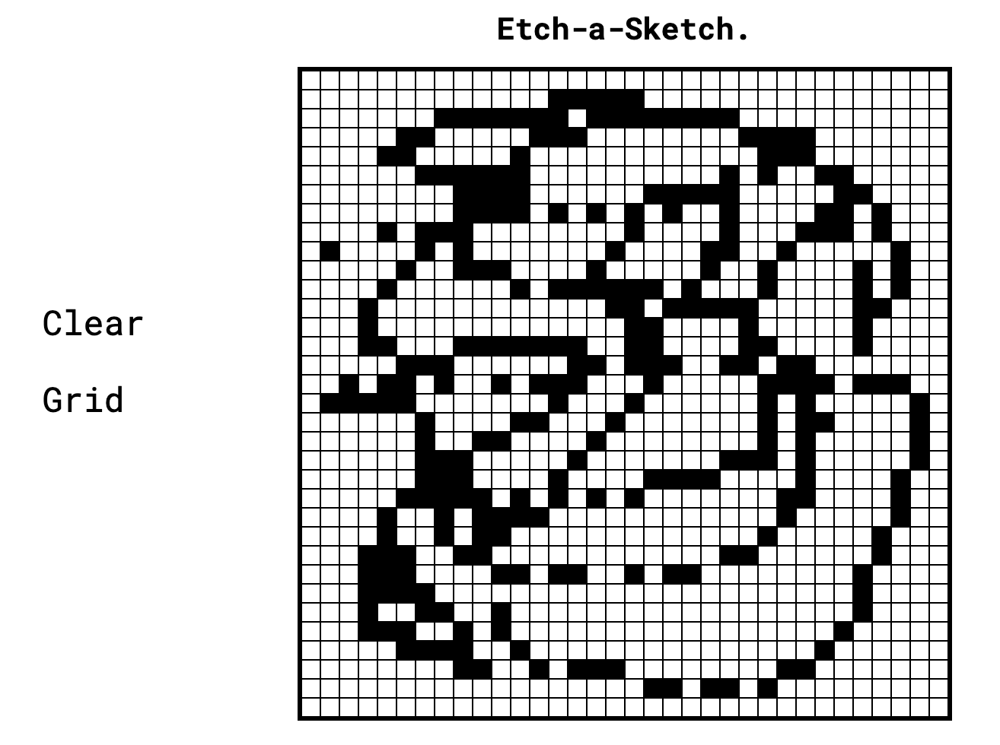

# Etch-a-Sketch

This project is a basic emulation of the actual etch-a-sketch drawing tool. I created this project for the purpose of applying and understanding JavaScript's DOM manipulation methods and events. It is under the **_Foundations > JavaScript Basics_** course of The Odin Project curriculum. It has been a challenging yet fun experience. I really enjoyed this one so far.

## Prerequisite

1. HTML Foundations

2. CSS Foundations

3. Flexbox

4. JavaScript Fundamentals

## Live Demo

Github Page (https://grenzk.github.io/etch-a-sketch/)

## Source

The Odin Project (https://www.theodinproject.com/paths/foundations/courses/foundations/lessons/etch-a-sketch-project)
